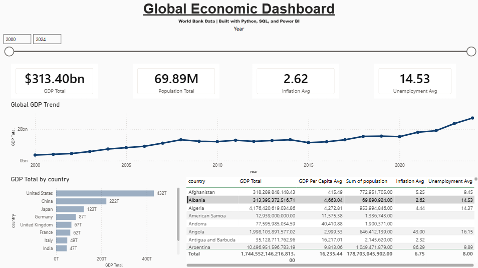

# World Bank Economic Indicators Data Mart + Power BI Dashboard

This project builds an end-to-end analytics pipeline using World Bank Open Data.

It demonstrates:
- API data ingestion using Python
- Data cleaning and transformation (long → wide format)
- Building a star-schema SQL data mart (SQLite)
- Interactive visualization using Power BI

---

## Dashboard Preview



---

## Tech Stack

- Python (requests, pandas)
- SQLite (star schema data mart)
- Power BI (dashboard & analytics)
- Git / GitHub
- VS Code

---

## Data Source

World Bank Open Data API  
Years: 2000–2024  

Indicators included:

- GDP (current US$): `NY.GDP.MKTP.CD`
- GDP per capita (current US$): `NY.GDP.PCAP.CD`
- Inflation (annual %): `FP.CPI.TOTL.ZG`
- Unemployment (%): `SL.UEM.TOTL.ZS`
- Population: `SP.POP.TOTL`

---

## Project Structure

```
notebooks/
  01_download_worldbank.ipynb
  02_build_data_mart_sqlite.ipynb

assets/
  dashboard.png

powerbi/
  worldbank_dashboard.pbix

data_raw/               (ignored in Git)
data_processed/         (ignored in Git)
db/                     (ignored in Git)
```

---

## Data Pipeline Overview

### Step 1 — Data Ingestion (Notebook 01)
- Pull indicator data from the World Bank API
- Combine multiple indicators
- Clean missing values
- Reshape into wide format
- Export country-only dataset for BI use

### Step 2 — SQL Data Mart (Notebook 02)
- Create SQLite database
- Build star schema:
  - `dim_country`
  - `dim_year`
  - `fact_country_economics`
- Insert cleaned data
- Validate with SQL queries

### Step 3 — Power BI Dashboard
- Import processed country-only dataset
- Build KPI cards
- Create GDP trend line
- Top 10 country comparison
- Interactive filtering by year

---

## How to Run the Project

### 1. Create Virtual Environment

```bash
python -m venv venv
```

Activate:

Windows (PowerShell):
```bash
venv\Scripts\Activate.ps1
```

Mac/Linux:
```bash
source venv/bin/activate
```

---

### 2. Install Dependencies

```bash
pip install -r requirements.txt
```

---

### 3. Run Notebook 01

Open and execute:

```
notebooks/01_download_worldbank.ipynb
```

This generates cleaned datasets in `data_processed/`.

---

### 4. Run Notebook 02

Open and execute:

```
notebooks/02_build_data_mart_sqlite.ipynb
```

This creates:

```
db/worldbank.db
```

---

### 5. Open Power BI Dashboard

Open:

```
powerbi/worldbank_dashboard.pbix
```

If prompted for data source paths, point Power BI to:

```
data_processed/world_bank_indicators_country_only.csv
```

---

## Example SQL Query

Top 10 countries by GDP (2022):

```sql
SELECT d.country_name, f.gdp_usd
FROM fact_country_economics f
JOIN dim_country d ON f.country_iso3 = d.country_iso3
WHERE f.year = 2022
ORDER BY f.gdp_usd DESC
LIMIT 10;
```

---

## Notes

- Regional and income-group aggregates are excluded from BI visuals.
- World Bank data may contain missing indicator values for some country-year combinations.
- Global totals in the dashboard are computed from country-level data.

---

## Author

Built as a portfolio project demonstrating:
- Data engineering fundamentals
- SQL modeling
- Business intelligence reporting
- End-to-end analytics workflow